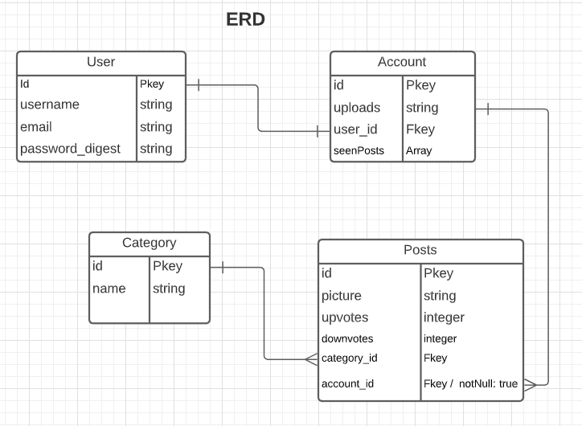

# Pluck Pluck Choose

Pluck Pluck Choose has a leaderboard of the cutest animals as decided by users. Each animal has upvotes and downvotes. The upvotes and downvotes are then compared against each other to establish a score for the animal. 
## A tinder clone of cute animals for users to vote or downvote on

### There are four primary models

## User
***
#### User Stories
A user has 
- username 
- email
- password with auth

A user is able to upload their own cute animal picture to get plucked up!

Each user is linked directly to their account

## Account
***
An account has 
- Uploads
- Seen Posts (so as not to repeat views)

# Post (animal)
A Post has an
- Picture
- Upvotes
- Downvotes
- Category Id

# Category
A Category has a name and nothing else.
It's primarily used as a filtration system for the user, so that if there are different kinds of posts or animals, they can sort by each one.

# Technologies Used

### PostgreSQL
PostgreSQL is used to make the database which stores the Users, Accounts, Posts, and Categories.

### Express
Express is used to access the database from the backend and communicate changes to the Posts (Upvotes and Downvotes)

### React
React is used with hooks to select whether an animal is cute or not

### Node.js
Node is used throughout the project as the code for it. 