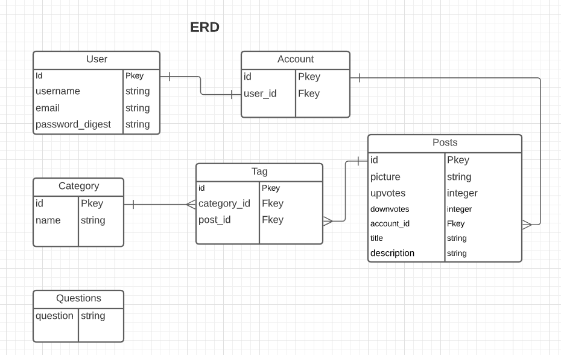

# Pluck Pluck Choose
#### Created December 11, 2020 By 
| Team | | |
| :------------ |:--------------------------------------:| :-----:|
|Minh Trinh     | [Github](https://github.com/mtrinh11) |[LinkedIn](https://www.linkedin.com/in/m-trinh/)  |
|Schuyler Luckey| [Github](https://github.com/Gnarlyluck)| [LinkedIn](https://www.linkedin.com/in/schuyler-luckey/) |  
|Nico Zanghi| [Github](https://github.com/nazanghi)| [LinkedIn](https://www.linkedin.com/in/nicozanghi/) |

## Description

Pluck Pluck Choose has a leaderboard of the cutest animals as decided by users. Each animal has upvotes and downvotes. The upvotes and downvotes are then compared against each other to establish a score for the animal. 
A tinder clone of cute animals for users to vote or downvote on.

## User Stories

A user is able to upload their own pictures to get plucked up!

Each user is linked directly to their account

## Technologies Used

### PostgreSQL
PostgreSQL is used to make the database which stores the Users, Accounts, Posts, and Categories.

### Express
Express is used to access the database from the backend and communicate changes to the Posts (Upvotes and Downvotes)

### React
React is used with hooks to select whether an animal is cute or not

### Node.js
Node is used throughout the project as the code for it. 

## Entity-Relationship Diagram

### Account
An account has 
- Uploads
- Seen Posts (so as not to repeat views)

### Post (animal)
A Post has an
- Picture
- Upvotes
- Downvotes
- Category Id

### Category
A Category has a name and nothing else.
It's primarily used as a filtration system for the user, so that if there are different kinds of posts or animals, they can sort by each one.

## Post-MVP

### Create A Would You Rather
Would you rather is a comparison chart to pretty much force a user to make a decision about each post. These can include really silly things like "Which would you save from a car wreck first?" or "Who's in your bank robbing squad?" This gets especially entertaining when you have incorporated different content for the posts, like putting a puppy up against a human baby. 

### Create A Debate messaging system
Users are able to debate 